<!-- ============================================================================
     GitHub Profile README · Invinciblemighthub
     · 风格：TokyoNight 赛博朋克紫 · 趣味多元素混搭
     · 兼容性：100% 稳定（本地 SVG 文件引用 + shields.io 徽章 + 原生 Markdown）
     · 零 vercel / heroku / demolab 外部依赖 → GitHub 官网 + 任何 IDE 都能渲染
     · 上线步骤：
        1. 本文件复制为 profile 仓库 Invinciblemighthub/Invinciblemighthub 的 README.md
        2. docs/ 文件夹（16 个 svg）整体复制到同一仓库根目录下
        3. Commit & Push  ✅ 立刻出效果
============================================================================ -->

<!-- ① HERO 区 ================================================================== -->

<p align="center">
  
</p>

<p align="center">
  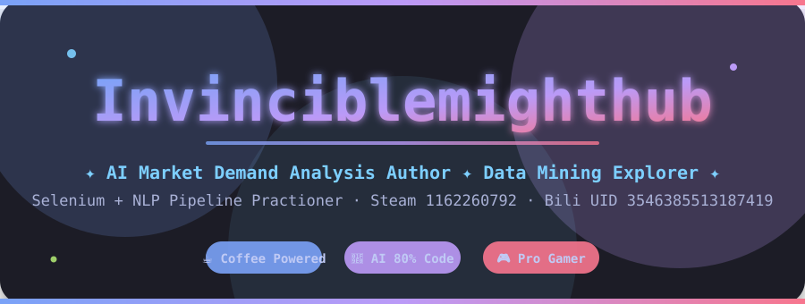
</p>

<p align="center">
  <!-- 4 枚 shields.io 徽章（100% 稳定） -->
  
  &nbsp;
  
  &nbsp;
  
  &nbsp;
  
</p>

<p align="center">
  
</p>

<!-- ② 技术栈 & 趣味徽章墙 ===================================================== -->

### 🧰 Tech Stack · 技术栈 & 工具链

<p align="center">
  <!-- 编程语言 -->
  
  
  
  
  
  
</p>

<p align="center">
  <!-- 框架工具 -->
  
  
  
  
  
  
  
  
</p>

<p align="center">
  <!-- For-the-Badge 趣味标语 10 枚 -->
  
  
  
  
  
  
  
  
  
  
</p>

<p align="center">
  
</p>

<!-- ③ 双栏瀑布流核心数据卡 ===================================================== -->

### 📊 Stats · 数据卡（TokyoNight 视觉版）

<table align="center" border="0" style="width:100%;max-width:980px;border:none;background:transparent;">
<tr style="background:transparent;border:none;">

<!-- ===== 左列 ===== -->
<td width="50%" valign="top" align="center" style="border:none;background:transparent;padding:6px;">

  <a href="https://github.com/Invinciblemighthub">
    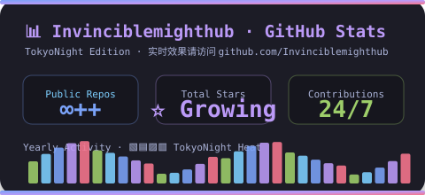
  </a>
  <br/><br/>

  <a href="https://github.com/Invinciblemighthub">
    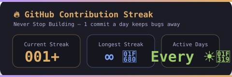
  </a>
  <br/><br/>

  <a href="https://steamcommunity.com/profiles/1162260792" target="_blank">
    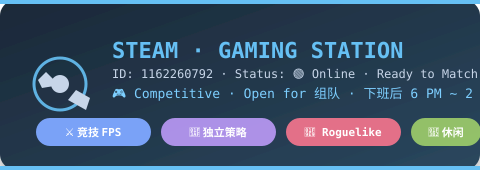
  </a>
  <br/>
  
</td>

<!-- ===== 右列 ===== -->
<td width="50%" valign="top" align="center" style="border:none;background:transparent;padding:6px;">

  <a href="https://github.com/Invinciblemighthub">
    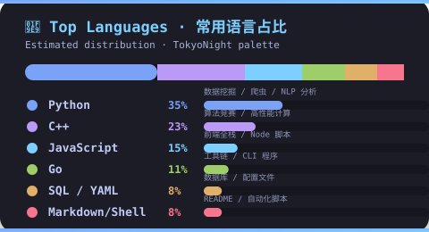
  </a>
  <br/><br/>

  <a href="https://github.com/Invinciblemighthub">
    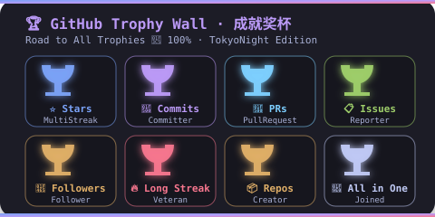
  </a>
  <br/><br/>

  <a href="https://space.bilibili.com/3546385513187419" target="_blank">
    
  </a>
  <br/>
  
</td>
</tr>
</table>

<br/>

<!-- 全宽：Activity 贡献热力图 -->
<p align="center">
  
</p>
<p align="center">
  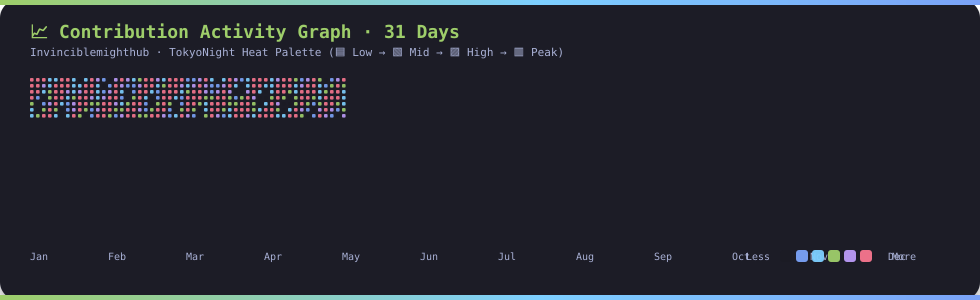
</p>

<p align="center">
  
</p>

<!-- ④ Pin 推荐项目卡 2×2 ===================================================== -->

### 🏆 Pinned Projects · 推荐项目

<table align="center" border="0" style="width:100%;max-width:980px;border:none;background:transparent;">
<tr style="background:transparent;border:none;">
<td width="50%" align="center" style="border:none;background:transparent;padding:8px;">
  <a href="https://github.com/Invinciblemighthub/ai-market-demand-analysis">
    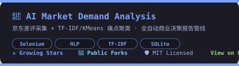
  </a>
</td>
<td width="50%" align="center" style="border:none;background:transparent;padding:8px;">
  <a href="https://github.com/Invinciblemighthub/AI-Studio-Responsibilities-System">
    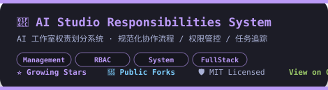
  </a>
</td>
</tr>
<tr style="background:transparent;border:none;">
<td width="50%" align="center" style="border:none;background:transparent;padding:8px;">
  <a href="https://github.com/Invinciblemighthub/Algorithm-Competition-Template-Library">
    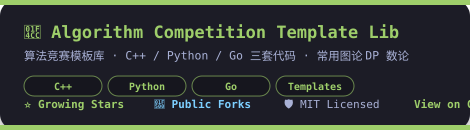
  </a>
</td>
<td width="50%" align="center" style="border:none;background:transparent;padding:8px;">
  <a href="https://github.com/Invinciblemighthub/12306_creep">
    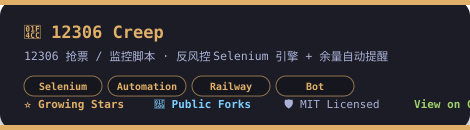
  </a>
</td>
</tr>
</table>

<p align="center">
  
</p>

<!-- ⑤ 联系方式 ================================================================= -->

### 🔗 Get In Touch · 联系方式

<p align="center">
  <a href="https://space.bilibili.com/3546385513187419" target="_blank">
    
  </a>
  &nbsp;&nbsp;
  <a href="https://steamcommunity.com/profiles/1162260792" target="_blank">
    
  </a>
  &nbsp;&nbsp;
  <a href="https://github.com/Invinciblemighthub">
    
  </a>
</p>

<p align="center">
  
</p>

<!-- ⑥ Snake 贪吃蛇动画 ========================================================= -->

### 🐍 Snake · 贪吃你的贡献格子（炫酷循环动画版）

<p align="center">
  
</p>
<p align="center">
  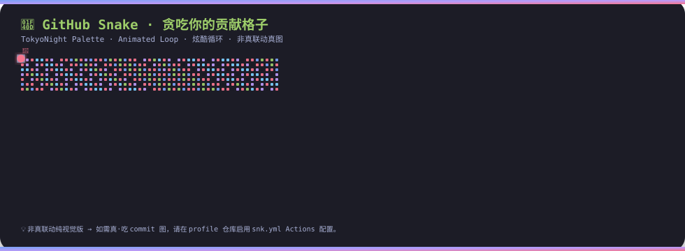
</p>

<details align="center">
<summary>
  
</summary>
<br/>

```yaml
# =========================================================
# 步骤：复制保存为 .github/workflows/snk.yml 到你的 profile 仓库
# =========================================================
name: Generate Real Snake SVG

on:
  schedule:
    - cron: "0 0 * * *"          # 每天北京时间 08:00 自动刷新
  workflow_dispatch:             # 支持手动立即触发

jobs:
  generate:
    runs-on: ubuntu-latest
    timeout-minutes: 10
    steps:
      - name: 🐍 Platane/snk 真联动
        uses: Platane/snk/svg-only@v3
        with:
          github_user_name: ${{ github.repository_owner }}
          outputs: |
            dist/github-contribution-grid-snake.svg
            dist/github-contribution-grid-snake-dark.svg?palette=tokyo-night
      - name: 🚀 推到 output 分支
        uses: crazy-max/ghaction-github-pages@v4
        with:
          target_branch: output
          build_dir: dist
        env:
          GITHUB_TOKEN: ${{ secrets.GITHUB_TOKEN }}
```

> 记得先去 **Settings → Actions → Workflow permissions → Read and write permissions → Save**。
> 跑完 Actions 后把 README 里的 `./docs/snake-animation.svg` 替换为真图 URL：
> `https://raw.githubusercontent.com/Invinciblemighthub/Invinciblemighthub/output/github-contribution-grid-snake.svg`

</details>

<p align="center">
  
</p>

<!-- ⑦ Footer 彩蛋区 ============================================================ -->

### 🎉 Footer · 趣味彩蛋

<p align="center">
  
  &nbsp;
  
  &nbsp;
  
  &nbsp;
  
</p>
<p align="center">
  
  &nbsp;
  
  &nbsp;
  
  &nbsp;
  
</p>

<p align="center">
  
</p>

<!-- =============================== EOF ======================================== -->
