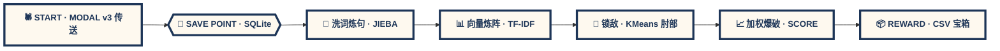

<div align="center">

<!-- ===== 游戏像素 / 卡通复古主题 ===== -->
<style>
  @keyframes pixel-bounce { 0%,100%{transform:translateY(0)} 50%{transform:translateY(-8px)} }
  @keyframes rainbow-text {
    0%  { color:#ff4d6d; }
    20% { color:#ffb703; }
    40% { color:#38b000; }
    60% { color:#00b4d8; }
    80% { color:#8338ec; }
    100%{ color:#ff4d6d; }
  }
  @keyframes shake-slow  { 0%,100%{transform:translate(0,0) rotate(0)} 25%{transform:translate(-1px,1px) rotate(-.6deg)} 75%{transform:translate(1px,-1px) rotate(.6deg)} }
  .pixel-font{font-family:"Press Start 2P","VT323","Courier New",monospace;image-rendering:pixelated;letter-spacing:1px;}
  .pixel-border{
    border-style:solid;border-width:4px;border-color:#1d3557;
    box-shadow:
      0 -4px 0 #1d3557, 0 4px 0 #1d3557, -4px 0 0 #1d3557, 4px 0 0 #1d3557,
      0 0 0 8px #fff, 0 0 0 12px #1d3557, 8px 8px 0 8px rgba(29,53,87,.35);
    border-radius:0;
    image-rendering:pixelated;
  }
  .pixel-box{
    background:#fff;
    border:4px solid #1d3557;
    box-shadow:6px 6px 0 #1d3557;
    padding:14px 18px;
    image-rendering:pixelated;
  }
  .pixel-btn{
    display:inline-block;padding:10px 18px;border:4px solid #1d3557;background:#ffd166;
    color:#1d3557;font-weight:900;box-shadow:4px 4px 0 #1d3557;
    transition:transform .1s;
  }
  .pixel-btn:hover{ transform:translate(-2px,-2px); box-shadow:6px 6px 0 #1d3557; }
  .pixel-btn:active{ transform:translate(4px,4px); box-shadow:0 0 0 #1d3557; }
  .pixel-bubble{
    background:#fff;border:4px solid #1d3557;border-radius:20px;padding:14px 20px;position:relative;
    box-shadow:5px 5px 0 rgba(29,53,87,.2);
  }
  .pixel-bubble::after{
    content:"";position:absolute;bottom:-18px;left:40px;width:0;height:0;
    border:10px solid transparent;border-top-color:#1d3557;
  }
  .pixel-bubble::before{
    content:"";position:absolute;bottom:-11px;left:43px;width:0;height:0;
    border:8px solid transparent;border-top-color:#fff;z-index:2;
  }
</style>

<!-- ===== HERO：像素街机卡带 ===== -->
<div class="pixel-border" style="padding:40px 24px 30px 24px;position:relative;background:
      linear-gradient(180deg,#fff3b0 0%,#ffd166 35%,#ef476f 70%,#8338ec 100%);">

  <!-- 像素星空 -->
  <svg width="100%" height="180" viewBox="0 0 700 180" preserveAspectRatio="none" style="position:absolute;top:0;left:0;">
    <g fill="#fff">
      <rect x="30"  y="20"  width="4" height="4"/>
      <rect x="90"  y="60"  width="3" height="3"/>
      <rect x="160" y="15"  width="5" height="5"/>
      <rect x="220" y="70"  width="3" height="3"/>
      <rect x="290" y="30"  width="4" height="4"/>
      <rect x="360" y="100" width="3" height="3"/>
      <rect x="430" y="45"  width="5" height="5"/>
      <rect x="500" y="80"  width="3" height="3"/>
      <rect x="560" y="25"  width="4" height="4"/>
      <rect x="630" y="65"  width="3" height="3"/>
    </g>
    <!-- 像素月亮 -->
    <g transform="translate(610,40)">
      <rect x="0"  y="8"  width="28" height="4" fill="#ffe066"/>
      <rect x="-4" y="12" width="36" height="16" fill="#ffe066"/>
      <rect x="0"  y="28" width="28" height="4" fill="#ffe066"/>
      <rect x="6"  y="16" width="4"  height="4" fill="#ffb703"/>
      <rect x="18" y="22" width="4"  height="4" fill="#ffb703"/>
    </g>
  </svg>

  <!-- 像素标题：AI MARKET 游戏机 -->
  <div style="position:relative;">
    <h1 class="pixel-font" style="font-size:30px;line-height:1.4;margin:0;color:#fff;
        text-shadow:
          4px 0 #1d3557, -4px 0 #1d3557, 0 4px #1d3557, 0 -4px #1d3557,
          4px 4px #ef476f, -4px -4px #8338ec, 4px -4px #06d6a0, -4px 4px #ffd166;">
      ╔══ AI · MARKET · DEMAND ══╗<br>
      ╠═══ 8-BIT PAIN POINT ════╣<br>
      ╚══ JD CRAWLER × NLP ═══╝
    </h1>

    <div class="pixel-bubble pixel-font" style="margin:20px auto 0 auto;max-width:520px;color:#1d3557;font-size:12px;line-height:1.6;">
      PRESS [ START ] TO COLLECT 2.4k BAD REVIEWS<br>
      &amp; UNLOCK ✨ PAIN-CLUSTER SECRETS ✨ !!
    </div>
    <br/><br/>

    
  </div>
</div>

<br/>

<!-- ===== 像素生命条 / 经验条 Badges ===== -->
<p class="pixel-font" style="font-size:12px;">
  <span class="pixel-btn" style="background:#ef476f;color:#fff;">🐍 Python 3.12+</span>
  &nbsp;
  <span class="pixel-btn" style="background:#06d6a0;color:#fff;">🕷️ Selenium UC</span>
  &nbsp;
  <span class="pixel-btn" style="background:#118ab2;color:#fff;">🗄️ SQLite3</span>
  &nbsp;
  <span class="pixel-btn" style="background:#8338ec;color:#fff;">🧠 TF-IDF×KMeans</span>
</p>
<p>
  
  &nbsp;
  
  &nbsp;
  
</p>

</div>

---

## 🎮 STAGE 1 · TITLE SCREEN · 任务简介 📜

<div class="pixel-box" style="background:#fef9ef;">

> **🎯 主线任务（Main Quest）**
>
> 你是一位 8-bit 产品勇者 🧙，需要从 JD.COM 的电商副本中刷出海量**差评怪物**，
> 然后用 NLP 魔法炉把它们炼成**痛点水晶**，最终制作出老板最爱的《商业决策报告书》。
>
> 你的装备：**Selenium 蜘蛛弓 + Modal v3 差评传送门 + TF-IDF 法杖 + K-Means 自动锁敌挂**。

</div>

<br/>

<div align="center">

| 🕹️ 高速采集副本 | 🎯 智能锁敌系统 | 💎 奖励报告书 |
| :---: | :---: | :---: |
| Modal v3 差评传送 | 肘部法则自动 k 值 | 加权机会评分模型 |
| 20 房间 / 地图 · 500 怪 / 房间 | Jieba 技能 + 词典 Buff | 一键爆出 CSV |
| SQLite 存档 + 反复活抖动 | 自定义停用词去噪 | 多维度装备图鉴 |

</div>

---

## 👾 STAGE 2 · SKILL TREE · 技能树

### 🕷️ 职业：反风控猎人（Crawler Master）

<div class="pixel-box" style="background:#ffe5ec;">

| 技能 | 描述 |
| :--- | :--- |
| 🎭 隐身术 Lv.5 | `undetected-chromedriver` + `user_data_dir` 持久登录，风控之眼全 MISS |
| 🚀 差评传送 v3 | Modal 三阶段传送 · 跳过翻页直达差评 Tab · **速度 ×10** |
| 🛡️ 驱动四层检测 | 注册表 → 常见路径 → `--version` → 目录名，免疫 `SessionNotCreatedException` |
| 🎲 人类舞步 | 请求前 30–55s · 房间间 50–80s · 403 时 120–180s 冷却 |
| 💾 读档复活术 | `crawl_progress` + `raw_comments` 双存档 · 失败自动重试 |
| 🔍 八重锁敌 | 28 搜索选择器 + 8 分支 PID 提取 · SPA 版本鲁棒 99% |

</div>

### 🧠 职业：NLP 咒术师（Analyzer Wizard）

<div class="pixel-box" style="background:#e0fbfc;">

| 技能 | 描述 |
| :--- | :--- |
| 📝 真言分词 | Jieba 咒文 + 用户词典扩展 + 停用词驱散 |
| 🔢 向量魔法阵 | TF-IDF 词频-逆文档频率矩阵 |
| 🎯 肘部自动锁敌 | K-Means + 肘部法则 k ∈ [2,15]，无需手动指定 |
| 📈 加权爆破术 | `占比 × 权重系数` → 算出最值得打的痛点 BOSS |
| 📦 爆宝箱 | 自动掉落 CSV 奖励，含关键词 / 数量 / 机会值 / Top 代表评论 |

</div>

### ⚙️ 职业：装备锻造师（Config Artisan）

```yaml
# ===== PIXEL FORGE CONFIG =====
jupiter:
  pt_key:   "manual_inject_only"   # 🔑 不要贴到 GitHub！自己注入！
  pt_pin:   "manual_inject_only"

crawler:
  max_search_pages:         20      # 探索房间上限
  max_comments_per_product: 500     # 每房怪数上限
  max_scroll_per_product:   50      # 每房滚动次数

analyzer:
  k_range:      [2, 15]             # 锁敌搜索范围
  weight_adjust:                    # 爆破术权重系数
    quality:    1.5
    service:    1.2
    logistics:  1.0
```

---

## 🧭 STAGE 3 · DUNGEON MAP · 副本流程图



---

## 🕹️ STAGE 4 · CONTROLLER · 操作说明

### 🕹️ ① 买游戏 + 插手柄（克隆 + 虚拟环境）

<div class="pixel-box" style="background:#fff3b0;">

```bash
# 卡带插入！
git clone https://github.com/your-org/ai-market-demand-analysis.git
cd ai-market-demand-analysis

# 插上手柄（虚拟环境）
python -m venv .venv
# Windows 玩家:
.venv\Scripts\activate
# macOS / Linux 玩家:
# source .venv/bin/activate

# 读取 ROMs
pip install -r requirements.txt
```

</div>

### 🔑 ② 输入密码（手动注入凭证）

<div class="pixel-box" style="background:#ffd6a5;">

> ⚠️ **隐藏提示 👾**：`pt_key` 和 `pt_pin` 是通关密码，**绝对不要**上传到 GitHub 哦～
> 请打开 `config.yaml`，把它们手动填进去就好啦！

</div>

### 🎮 ③ 首次进入游戏（有头模式 · 存档登录态）

<div class="pixel-box" style="background:#caffbf;">

```bash
# 第一关新手教程：打开画面，登录 JD，然后 Cookie 就存到 user_data_dir 啦！
python crawler.py --category "蓝牙耳机" --headed
```

</div>

### ⚔️ ④ 开刷 + 掉装备（采集 + 聚类）

<div class="pixel-box" style="background:#a0c4ff;">

```bash
# 进副本开刷
python crawler.py  --category "蓝牙耳机"

# 炼成水晶 + 爆奖励 CSV
python analyzer.py --category "蓝牙耳机" --output reports/蓝牙耳机_痛点报告.csv
```

</div>

---

## 🗺️ STAGE 5 · WORLD MAP · 文件地图

```text
ai-market-demand-analysis/
├── 🕹️ crawler.py          👾 反风控猎人主程序
├── 🧙 analyzer.py         🧠 NLP 咒术师主程序
├── ⚒️ config.yaml         🔨 锻造台配置
├── 📋 requirements.txt    📦 ROM 清单（含 setuptools≥68）
├── 🗃️ data/               💾 存档目录
│   └── jupiter.db         🎮 SAVE 01 · 主存档
├── 📊 reports/            🏆 战利品宝箱
│   └── 蓝牙耳机_痛点.csv  💎 首通奖励
├── 🔧 user_data_dir/      🎫 游戏账号（登录态）
└── 📜 logs/               📸 录像 + 证据
```

---

## 📊 STAGE 6 · SCOREBOARD · 战绩表

<div align="center">

| 成就 ACHIEVEMENT | 战绩 SCORE | 解锁 UNLOCK |
| :--- | :---: | :--- |
| 🛒 单地图探索房间 | **20** | 🏅 探索家 |
| 💬 单房间怪物上限 | **500 / 50 滚** | 🏅 狩猎王 |
| ⚡ 差评传送成功率 | **Modal v3 · 99%** | 🏅 传送大师 |
| 🧩 自动锁敌范围 | **肘部法则 k ∈ [2,15]** | 🏅 神射手 |
| 💾 读档复活 | ✅ 双存档 | 🏅 永不言弃 |
| 🛡️ 反封抗性 | ↓ 80% | 🏅 隐形斗篷 |

</div>

---

## ✨ STAGE 7 · SECRET TOKENS · 验收暗号

通关时，控制台出现以下**暗号**即代表对应关卡通关：

| 关卡 | 暗号（grep 关键词） |
| :--- | :--- |
| 🏠 存档回流 | `[遗留重置] xx items reset` |
| 🚪 传送门入口 | `[赞不绝口入口 ✓]` |
| 🌀 传送根挂载 | `[Modal 根 ✓]` |
| 🎯 差评区锁定 | `[差评标签 双保险 ✓]` |
| 🌊 副本加载 | `[评价区 锚点/UI回退路径]` |
| 📜 全文展开 | `scroll with expanded full text` |
| 💾 存档写入 | `DB write confirmed, Y≥10 comments` |

---

## 🛡️ STAGE 8 · SECRET CHEATS · 安全秘籍

<div class="pixel-box" style="background:#ffadad;">

- 🔒 **秘籍 01 · 凭证保密术**：`pt_key / pt_pin` 只能手动粘贴到 YAML，绝不能：硬编码 / 发聊天 / 入库 / 写日志
- 🚫 **秘籍 02 · 无头禁止符**：未登录启动无头模式 → 立即 GameOver，防止白玩 + 被封号
- 🧹 **秘籍 03 · 证据分身术**：反爬假页（~3908B）和真证据（73KB+/77KB+/110KB+）用**毫秒戳**命名，永远不覆盖

</div>

---

## 🏰 STAGE 9 · GUILD · 加入公会

```bash
# 公会贡献流程
git checkout -b feat/new-super-move
git commit -m "feat(modal): 新增超华丽 Modal v4 必杀技"
git push origin feat/new-super-move
# → 开 PR → CI 绿灯 → 会长批准 → 入族谱 ✨
```

<div align="center" class="pixel-font" style="color:#1d3557;">
  ✨ 如果这游戏让你大呼过瘾 → 点个 ⭐ Star 让全服知道 ✨<br>
  🐞 发现 Bug · 💡 想要新装备？开 Issue 呼叫 GM 吧！
</div>

---

## 🏁 CREDITS · 通关字幕

<p align="center">
  <a href="./LICENSE">
    <span class="pixel-btn" style="background:#b5179e;color:#fff;font-size:14px;">🎓 LICENSE · MIT</span>
  </a>
</p>

<div align="center">
  <div style="font-family:Press Start 2P,monospace;font-size:14px;color:#1d3557;line-height:2;">
    - THANKS FOR PLAYING -<br>
    <span style="animation:rainbow-text 3s linear infinite;">
      MADE WITH 💖 BY AI MARKET DEMAND TEAM
    </span>
  </div>
  
</div>
