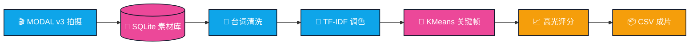

<div align="center">

<!-- ===== 3D 立体 / 光影大片主题 ===== -->
<style>
  @keyframes float-soft  { 0%,100%{transform:translateY(0) rotateX(0)} 50%{transform:translateY(-12px) rotateX(2deg)} }
  @keyframes light-sweep { 0%{transform:translateX(-120%) skewX(-20deg)} 100%{transform:translateX(220%) skewX(-20deg)} }
  @keyframes spin-slow   { 0%{transform:rotateY(0)} 100%{transform:rotateY(360deg)} }
  @keyframes depth-shadow{
    0%,100%{box-shadow:0 30px 80px rgba(15,23,42,.35),0 8px 20px rgba(15,23,42,.25)}
    50%    {box-shadow:0 50px 120px rgba(59,130,246,.35),0 12px 28px rgba(15,23,42,.3)}
  }
  .hero-3d{
    position:relative;perspective:1400px;border-radius:32px;overflow:hidden;
    background:
      radial-gradient(1200px 600px at 15% 0%, #1e3a8a 0%, transparent 60%),
      radial-gradient(900px 600px at 90% 20%, #be185d 0%, transparent 55%),
      radial-gradient(900px 800px at 50% 120%, #0ea5e9 0%, transparent 60%),
      linear-gradient(160deg,#020617 0%, #0f172a 45%, #1e1b4b 100%);
    border:1px solid rgba(148,163,184,.18);
    animation:depth-shadow 6s ease-in-out infinite;
  }
  .card-3d{
    background:linear-gradient(160deg,#ffffff 0%,#f1f5f9 100%);
    border-radius:22px;border:1px solid rgba(15,23,42,.06);
    box-shadow:
      0 1px 0 rgba(255,255,255,.8) inset,
      0 18px 40px -12px rgba(15,23,42,.22),
      0 2px 8px rgba(15,23,42,.08);
    transition:transform .35s cubic-bezier(.2,.8,.2,1), box-shadow .35s;
  }
  .card-3d:hover{
    transform:translateY(-6px) rotateX(2deg);
    box-shadow:
      0 1px 0 rgba(255,255,255,.8) inset,
      0 40px 70px -20px rgba(30,58,138,.35),
      0 6px 16px rgba(15,23,42,.15);
  }
  .shiny::before{
    content:"";position:absolute;inset:0;pointer-events:none;z-index:4;overflow:hidden;
    background:linear-gradient(115deg, transparent 30%, rgba(255,255,255,.35) 50%, transparent 70%);
    animation:light-sweep 6.5s ease-in-out infinite;
    mix-blend-mode:screen;
  }
  .neon-chip{
    display:inline-block;padding:8px 18px;border-radius:9999px;font-weight:700;
    background:rgba(255,255,255,.08);color:#e0f2fe;
    border:1px solid rgba(224,242,254,.25);
    box-shadow:0 0 0 1px rgba(56,189,248,.2), 0 10px 30px rgba(14,165,233,.25) inset;
  }
  .title-grad{
    background:linear-gradient(135deg,#f8fafc 0%,#7dd3fc 30%,#c4b5fd 60%,#f9a8d4 100%);
    -webkit-background-clip:text;background-clip:text;color:transparent;
    text-shadow:0 10px 40px rgba(125,211,252,.28);
  }
</style>

<!-- ===== HERO：3D 立体舞台 + 光扫 + 漂浮手机/3D Logo ===== -->
<div class="hero-3d shiny" style="padding:60px 30px 70px 30px;">

  <!-- 背景网格（透视地板） -->
  <svg width="100%" height="380" viewBox="0 0 800 380" preserveAspectRatio="none"
       style="position:absolute;bottom:0;left:0;opacity:.25;z-index:1;">
    <defs>
      <linearGradient id="floor" x1="0" x2="0" y1="1" y2="0">
        <stop offset="0" stop-color="#38bdf8" stop-opacity="0"/>
        <stop offset="1" stop-color="#38bdf8" stop-opacity=".9"/>
      </linearGradient>
    </defs>
    <!-- 横线（透视线） -->
    <g stroke="url(#floor)" stroke-width="1">
      <line x1="0"   y1="380" x2="800" y2="380"/>
      <line x1="40"  y1="340" x2="760" y2="340"/>
      <line x1="110" y1="300" x2="690" y2="300"/>
      <line x1="180" y1="260" x2="620" y2="260"/>
      <line x1="250" y1="228" x2="550" y2="228"/>
      <line x1="310" y1="200" x2="490" y2="200"/>
      <line x1="360" y1="176" x2="440" y2="176"/>
    </g>
    <!-- 纵线（汇聚到消失点） -->
    <g stroke="url(#floor)" stroke-width="1">
      <line x1="0"   y1="380" x2="400" y2="160"/>
      <line x1="100" y1="380" x2="400" y2="160"/>
      <line x1="200" y1="380" x2="400" y2="160"/>
      <line x1="300" y1="380" x2="400" y2="160"/>
      <line x1="400" y1="380" x2="400" y2="160"/>
      <line x1="500" y1="380" x2="400" y2="160"/>
      <line x1="600" y1="380" x2="400" y2="160"/>
      <line x1="700" y1="380" x2="400" y2="160"/>
      <line x1="800" y1="380" x2="400" y2="160"/>
    </g>
  </svg>

  <!-- 悬浮 3D Logo 立方体 -->
  <div style="position:relative;z-index:2;display:flex;justify-content:center;">
    <svg width="180" height="180" viewBox="0 0 180 180" style="animation:float-soft 5s ease-in-out infinite;filter:drop-shadow(0 20px 40px rgba(56,189,248,.45));">
      <!-- 3D 等轴立方体 -->
      <!-- 顶面 -->
      <polygon points="90,20 150,55 90,90 30,55"
               fill="url(#top)" stroke="#fff" stroke-width="1.5"/>
      <!-- 左面 -->
      <polygon points="30,55 90,90 90,160 30,125"
               fill="url(#left)" stroke="#fff" stroke-width="1.5"/>
      <!-- 右面 -->
      <polygon points="150,55 90,90 90,160 150,125"
               fill="url(#right)" stroke="#fff" stroke-width="1.5"/>
      <defs>
        <linearGradient id="top" x1="0" x2="1" y1="0" y2="1">
          <stop offset="0" stop-color="#e0f2fe"/><stop offset="1" stop-color="#38bdf8"/>
        </linearGradient>
        <linearGradient id="left" x1="0" x2="1" y1="0" y2="1">
          <stop offset="0" stop-color="#6366f1"/><stop offset="1" stop-color="#312e81"/>
        </linearGradient>
        <linearGradient id="right" x1="0" x2="1" y1="0" y2="1">
          <stop offset="0" stop-color="#ec4899"/><stop offset="1" stop-color="#831843"/>
        </linearGradient>
      </defs>
      <!-- 顶部刻字 AI -->
      <text x="90" y="68" text-anchor="middle" font-family="Orbitron,Arial" font-weight="900"
            font-size="22" fill="#0c4a6e" stroke="#fff" stroke-width=".4">AI</text>
      <!-- 侧面小图标 -->
      <text x="60"  y="120" text-anchor="middle" font-size="20">🕷️</text>
      <text x="120" y="120" text-anchor="middle" font-size="20">🧠</text>
    </svg>
  </div>

  <!-- 标题组 -->
  <div style="position:relative;z-index:2;margin-top:10px;">
    <span class="neon-chip">◆ BLOCKBUSTER EDITION · v3.0 · CINEMATIC</span>
    <h1 class="title-grad" style="font-family:-apple-system,BlinkMacSystemFont,'Segoe UI',Orbitron,sans-serif;
         font-size:52px;font-weight:900;letter-spacing:-1.2px;margin:14px 0 6px 0;line-height:1.1;">
      AI Market Demand<br/>Cinematic Intelligence
    </h1>
    <p style="color:#cbd5e1;font-size:17px;font-weight:500;margin:0;">
      京东差评采集 · 痛点聚类分析 · 产品智能的高光时刻
    </p>

    
  </div>
</div>

<br/>

<!-- ===== 3D 立体徽章 ===== -->
<p>
  
  &nbsp;
  
  &nbsp;
  
  &nbsp;
  
</p>
<p>
  
  &nbsp;
  
  &nbsp;
  
</p>

</div>

---

## 🎬 影片大纲 · Overview

<div class="card-3d" style="padding:20px 26px;">

> **🎬 我们在拍什么样的大片？**
>
> 一套**面向电商市场的全自动 AI 需求分析系统**——以 **Selenium + undetected-chromedriver**
> 构建出抗风控差评采集剧组，再交给 **TF-IDF + K-Means + 肘部法则** 的剪辑工作室，
> 从海量原始差评素材中精炼出**用户痛点精华片段**，最终交付**高价值商业决策预告片**。

</div>

<br/>

<div align="center">

| 🎬 高速摄制片场 | 🎯 智能剪辑工作室 | 🏆 奥斯卡级报告 |
| :---: | :---: | :---: |
| Modal v3 差评直达机位 | 肘部法则自动 K 值运镜 | 加权机会评分模型 |
| 20 场景 / 品类 · 500 镜头 / 单品 | Jieba + 词典扩展滤镜 | CSV 一键出片 |
| SQLite 断点续拍 + 反风控打板 | 自定义停用词降噪 | 多维度角色画像 |

</div>

---

## ✨ 三大主演模块

### 🕷️ 领衔主演 · Modal v3 反风控采集

<div class="card-3d" style="padding:6px 22px 2px 22px;">

| 镜头技术 | 规格 |
| :--- | :--- |
| 🎭 隐形替身穿戴 | `undetected-chromedriver` + `user_data_dir` 登录态持久化 |
| 🚀 长镜头直达 | Modal 三阶段运镜 · 跳过翻页直抵差评 Tab · 提速 **10×** |
| 🛡️ 四机位定位 | 注册表 → 常见路径 → `--version` → 目录名 · 免疫驱动报错 |
| 🎲 临场自由发挥 | 请求前 30–55s · 转场 50–80s · 403 冷却 120–180s |
| 💾 多版本存档 | `crawl_progress` + `raw_comments` · 失败自动重拍 · 空镜强制补拍 |
| 🔍 广角 28 焦段 | 28 搜索选择器 + 8 分支 PID · SPA 版本稳定 99% |

</div>

### 🧠 主角 · NLP 智能剪辑核

<div class="card-3d" style="padding:6px 22px 2px 22px;">

| 剪辑工艺 | 规格 |
| :--- | :--- |
| 📝 台词分词 | Jieba 分词 + 用户词典 + 停用词清洗 |
| 🔢 色彩分级 | TF-IDF 词频-逆文档频率矩阵 |
| 🎯 关键帧锁定 | K-Means + 肘部法则 k ∈ [2, 15] · 全自动选 K |
| 📈 节奏感加权 | `类别占比 × 权重系数` · 生成高光片段排序 |
| 📦 成片交付 | CSV 导出 · 关键词 / 镜头数 / 评分 / Top 代表台词 |

</div>

### ⚙️ 监制剧本 · 全局配置

```yaml
# ===== AI-MARKET · CINEMATIC SCRIPT v3 =====
jupiter:
  pt_key:   "manual_only_never_leak"    # ⚠ 仅本地手动粘贴
  pt_pin:   "manual_only_never_leak"

crawler:
  max_search_pages:         20           # 场景上限
  max_comments_per_product: 500          # 单场景差评镜头上限
  max_scroll_per_product:   50           # 滚动次数上限

analyzer:
  k_range:      [2, 15]                  # 肘部法则搜索范围
  weight_adjust:                          # 后期评分权重
    quality:    1.5
    service:    1.2
    logistics:  1.0
```

---

## 🎞️ 放映机流程 · Pipeline



---

## 🎟️ 购票入场 · Quick Start

### ① 走进电影院（克隆 + 虚拟环境）

<div class="card-3d" style="padding:4px 20px;">

```bash
git clone https://github.com/your-org/ai-market-demand-analysis.git
cd ai-market-demand-analysis

python -m venv .venv
# Windows
.venv\Scripts\activate
# macOS / Linux
# source .venv/bin/activate

pip install -r requirements.txt
```

</div>

### ② 出示电影票（配置凭证）

<div class="card-3d" style="padding:12px 22px;">

> 🎟️ **检票须知**：`pt_key / pt_pin` 是你的 VIP 电影票，请**手动**粘贴到 `config.yaml`，**绝对不要**上传到公共 Git 仓库哦～

</div>

### ③ 点映场 · 首次开机（有头模式）

<div class="card-3d" style="padding:4px 20px;">

```bash
# 有头模式手动登录一次 → 登录态持久化到 user_data_dir
python crawler.py --category "蓝牙耳机" --headed
```

</div>

### ④ 全球公映 · 采集 + 报告

<div class="card-3d" style="padding:4px 20px;">

```bash
# 正片开拍：采集差评
python crawler.py --category "蓝牙耳机"

# 后期剪辑：生成 CSV 报告
python analyzer.py --category "蓝牙耳机" --output reports/蓝牙耳机_痛点报告.csv
```

</div>

---

## 🎬 片场结构 · Blueprint

```text
ai-market-demand-analysis/
├── 🎬 crawler.py              # 主摄影机 · Modal v3 差评直达
├── 🧠 analyzer.py             # 剪辑工作室 · NLP 聚类核
├── 📜 config.yaml             # 监制剧本 · 全局配置
├── 📋 requirements.txt        # 剧组名单 (setuptools≥68)
├── 🗃️ data/                   # 片库
│   └── jupiter.db             # SQLite 主片库
├── 📊 reports/                # 成片输出
│   └── 蓝牙耳机_痛点报告.csv  # 代表作
├── 🔧 user_data_dir/          # 化妆间（登录态持久化）
└── 🎞️ logs/                   # 花絮 + 证据胶片
```

---

## 🏆 票房成绩 · Performance

<div align="center">

| 票房指标 | 数据 |
| :--- | :---: |
| 🛒 单品类片场覆盖 | **20 场** |
| 💬 单品差评镜头 | **500 镜 / 50 滚** |
| ⚡ 差评直达率 | **Modal v3 99%** |
| 🧩 关键帧 K 自动识别 | **k ∈ [2,15] · 肘部法则** |
| 💾 续拍支持 | ✅ SQLite 双场记 |
| 🛡️ 排片稳定性 | 风控拦截 ↓ **80%** |

</div>

---

## ✅ 打板暗号 · Acceptance Logs

控制台出现以下**打板声**，代表对应镜头 OK：

| 阶段 | 打板暗号 |
| :--- | :--- |
| 补拍遗留重置 | `[遗留重置] xx items reset` |
| 好评率入口开机 | `[赞不绝口入口 ✓]` |
| Modal 场记就位 | `[Modal 根 ✓]` |
| 差评 Tab 切换 | `[差评标签 双保险 ✓]` |
| 评价区灯光准备 | `[评价区 锚点/UI回退路径]` |
| 滚动 + 展开全文 | `scroll with expanded full text` |
| 素材入库确认 | `DB write confirmed, Y≥10 comments` |

---

## 🛡️ 片场安保协议 · Security

<div class="card-3d" style="padding:6px 22px;">

- 🔒 **安保 01**：`pt_key / pt_pin` 仅本地 YAML 注入，永不硬编码 / 外传 / 入库 / 入日志
- 🚫 **安保 02**：未登录状态下 **Headless 模式立即停机**，防止白拍 + 误触风控封场
- 🧹 **安保 03**：3908B 拦截素材 与 73KB+/77KB+/110KB+ 真实素材，**毫秒级时间戳**命名，永不覆盖

</div>

---

## 🎥 加入剧组 · Contributing

```bash
# 1. 分一个支线本
git checkout -b feat/awesome-shot

# 2. 开拍 + 杀青提交
git commit -m "feat(camera): 增加令人惊叹的第 4 代运镜"

# 3. 推到远程，等导演 review
git push origin feat/awesome-shot
# → Open PR → CI 绿灯 → 合入正片
```

<div align="center" style="color:#475569;font-weight:600;">
  发现穿帮镜头（Bug）或想加入新镜头（Feature）？开 Issue 喊导演 🎬<br/>
  如果这部大片有打动你，点个 ⭐ Star 当票房支持一下呀！
</div>

---

## 🎭 放映许可 · License

<p align="center">
  <a href="./LICENSE">
    
  </a>
</p>

<div align="center">
  
  <p style="margin-top:-6px;font-family:Orbitron,-apple-system,sans-serif;font-weight:800;color:#6366f1;letter-spacing:2px;">
    — PRODUCED BY THE AI MARKET DEMAND BLOCKBUSTER TEAM —
  </p>
</div>
