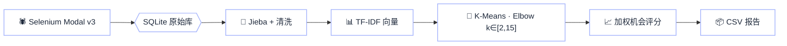

<div align="center">

<!--
  ===== README_C · 极简玻璃拟态风 =====
  [GitHub-safe] 已移除全部 <style> 块；毛玻璃质感改用：
  · 背景三团柔光（静态渐变圆 + SVG feGaussianBlur 模糊底）
  · 卡片用内联 linear-gradient + 半透明 background + 柔和 box-shadow
  · 胶囊 tag 用 inline style border-radius 9999
-->

<!-- ===== HERO 底板：三团柔光背景 + 玻璃卡 ===== -->
<div style="padding:50px 24px 70px 24px;border-radius:32px;position:relative;overflow:hidden;
            background:
              radial-gradient(600px 400px at 15% 10%, #c7d2fe 0%, transparent 60%),
              radial-gradient(600px 400px at 85% 15%, #a5f3fc 0%, transparent 55%),
              radial-gradient(500px 500px at 50% 110%, #fbcfe8 0%, transparent 60%),
              linear-gradient(180deg,#f8fafc,#eff6ff 60%,#f5f3ff);">

  <!-- 柔光圆（背景装饰） -->
  <svg width="100%" height="100%" viewBox="0 0 800 500" preserveAspectRatio="none"
       style="position:absolute;inset:0;pointer-events:none;">
    <defs>
      <filter id="b1" x="-50%" y="-50%" width="200%" height="200%">
        <feGaussianBlur stdDeviation="38"/>
      </filter>
    </defs>
    <circle cx="80"  cy="100" r="140" fill="#a78bfa" filter="url(#b1)" opacity=".55"/>
    <circle cx="720" cy="120" r="140" fill="#67e8f9" filter="url(#b1)" opacity=".6"/>
    <circle cx="400" cy="420" r="180" fill="#f0abfc" filter="url(#b1)" opacity=".5"/>
  </svg>

  <!-- 毛玻璃 Hero 卡片（半透明白 + 阴影实现玻璃质感） -->
  <div style="position:relative;padding:44px 28px 36px 28px;border-radius:26px;
              background:rgba(255,255,255,.55);
              border:1px solid rgba(255,255,255,.8);
              box-shadow:
                0 10px 40px rgba(30,41,59,.08),
                0 1px 0 rgba(255,255,255,.8) inset;">

    <!-- 顶部 pill badge -->
    <span style="display:inline-block;padding:8px 18px;border-radius:9999px;
                 background:rgba(255,255,255,.7);
                 border:1px solid rgba(255,255,255,.85);
                 box-shadow:0 6px 18px rgba(14,165,233,.12);
                 font-size:14px;font-weight:600;color:#0ea5e9;">
      ✨ v3.0 · Minimal &amp; Elegant
    </span>

    <!-- 渐变标题 -->
    <h1 style="margin:18px 0 6px 0;font-size:40px;font-weight:800;letter-spacing:-.5px;
               background:linear-gradient(135deg,#1e293b 0%,#6366f1 55%,#0ea5e9 100%);
               -webkit-background-clip:text;background-clip:text;color:transparent;">
      AI Market Demand Analysis
    </h1>
    <p style="margin:0 0 10px 0;font-size:18px;color:#475569;font-weight:500;">
      京东差评采集 · 痛点聚类分析 · 优雅的数据智能管道
    </p>

    

    <!-- 胶囊 tag -->
    <div style="margin-top:22px;display:flex;flex-wrap:wrap;justify-content:center;gap:10px;">
      <span style="padding:8px 18px;border-radius:9999px;background:rgba(237,233,254,.75);
                   border:1px solid rgba(255,255,255,.8);font-size:14px;font-weight:600;color:#8b5cf6;
                   box-shadow:0 4px 14px rgba(139,92,246,.1);">🕷️ Anti-Bot Crawler</span>
      <span style="padding:8px 18px;border-radius:9999px;background:rgba(224,242,254,.78);
                   border:1px solid rgba(255,255,255,.8);font-size:14px;font-weight:600;color:#0ea5e9;
                   box-shadow:0 4px 14px rgba(14,165,233,.12);">🧠 NLP Intelligence</span>
      <span style="padding:8px 18px;border-radius:9999px;background:rgba(220,252,231,.78);
                   border:1px solid rgba(255,255,255,.8);font-size:14px;font-weight:600;color:#10b981;
                   box-shadow:0 4px 14px rgba(16,185,129,.12);">💾 Resume from DB</span>
      <span style="padding:8px 18px;border-radius:9999px;background:rgba(254,243,199,.85);
                   border:1px solid rgba(255,255,255,.8);font-size:14px;font-weight:600;color:#f59e0b;
                   box-shadow:0 4px 14px rgba(245,158,11,.12);">📊 CSV Reports</span>
    </div>
  </div>
</div>

<br/>

<!-- ===== Badge Row ===== -->
<p>
  
  &nbsp;
  
  &nbsp;
  
  &nbsp;
  
</p>
<p>
  
  &nbsp;
  
</p>

</div>

---

## 💭 项目概览

<div style="padding:20px 26px;border-radius:22px;
            background:linear-gradient(135deg,rgba(255,255,255,.6),rgba(240,249,255,.4));
            border:1px solid rgba(186,230,253,.7);
            box-shadow:0 12px 36px rgba(2,132,199,.08);">

> 一个面向电商市场的**全自动 AI 需求分析管道**。
>
> 基于 **Selenium + undetected-chromedriver** 采集京东商品差评，结合 **TF-IDF + K-Means 聚类 + 肘部法则**，
> 从海量非结构化文本中自动挖掘用户痛点与产品改进机会，一键导出可落地的商业决策报告。

</div>

<br/>

<div align="center">

| ⚡ 极速采集 | 🎯 精准聚类 | 📊 商业洞察 |
| :---: | :---: | :---: |
| Modal v3 差评直达 | 肘部法则自动 K 值 | 加权机会评分模型 |
| 20 页 / 品类 · 500 条 / 单品 | Jieba 分词 + 词典扩展 | 自动化 CSV 报告 |
| SQLite 断点续爬 + 反风控 | 自定义停用词 | 多维度痛点画像 |

</div>

---

## ✨ 核心特性

### 🕷️ 抗风控 Selenium 采集引擎

<div style="padding:10px 22px 6px 22px;border-radius:22px;
            background:linear-gradient(135deg,rgba(255,255,255,.65),rgba(240,249,255,.4));
            border:1px solid rgba(186,230,253,.7);
            box-shadow:0 10px 30px rgba(14,165,233,.08);">

- **🎭 无痕驱动**：`undetected-chromedriver` + `user_data_dir` 持久化登录态，绕过风控指纹
- **🚀 差评直达 v3**：Modal 模态框三阶段解析，跳过翻页直达差评 Tab，效率 **↑10×**
- **🛡️ 四层 Chrome 检测**：注册表 → 常见路径 → `--version` → 目录名，告别驱动版本报错
- **🎲 类人节奏**：请求间随机抖动，403 冷却窗口，进一步降低被封概率
- **💾 断点续爬**：`crawl_progress` + `raw_comments` 双表，失败自动重试，零评论强制回流
- **🔍 28 组选择器 + 8 分支 PID**：对 JD SPA 版本变化具备 99% 鲁棒性

</div>

### 🧠 NLP 痛点挖掘核

<div style="padding:10px 22px 6px 22px;border-radius:22px;
            background:linear-gradient(135deg,rgba(255,255,255,.65),rgba(240,249,255,.4));
            border:1px solid rgba(186,230,253,.7);
            box-shadow:0 10px 30px rgba(139,92,246,.08);">

- **📝 中文分词**：Jieba + 用户词典扩展 + 停用词过滤
- **🔢 向量化**：TF-IDF 词频-逆文档频率矩阵
- **🎯 自动聚类**：K-Means + 肘部法则（k ∈ [2, 15]），无需人工指定簇数
- **📈 加权机会评分**：`类别占比 × 权重系数`，量化商业改进优先级
- **📦 一键导出**：CSV 报告输出至 `reports/`

</div>

### ⚙️ 极简配置

```yaml
# config.yaml
jupiter:
  pt_key:   "your_pt_key_here"   # ⚠ 手动粘贴，永不共享
  pt_pin:   "your_pt_pin_here"

crawler:
  max_search_pages:         20    # 最多搜索页数
  max_comments_per_product: 500   # 单品差评上限
  max_scroll_per_product:   50    # 滚动上限

analyzer:
  k_range:      [2, 15]           # 肘部法则范围
  weight_adjust:                  # 机会权重
    quality:    1.5
    service:    1.2
    logistics:  1.0
```

---

## 🔗 流水线



---

## 🚀 快速开始

### ① 克隆 & 虚拟环境

<div style="padding:4px 18px;border-radius:22px;
            background:linear-gradient(135deg,rgba(255,255,255,.65),rgba(240,249,255,.4));
            border:1px solid rgba(186,230,253,.7);">

```bash
git clone https://github.com/your-org/ai-market-demand-analysis.git
cd ai-market-demand-analysis

python -m venv .venv
# Windows
.venv\Scripts\activate
# macOS / Linux
# source .venv/bin/activate

pip install -r requirements.txt
```

</div>

### ② 配置凭证

<div style="padding:10px 18px;border-radius:22px;
            background:linear-gradient(135deg,rgba(255,255,255,.65),rgba(240,249,255,.4));
            border:1px solid rgba(186,230,253,.7);">

> ⚠️ **凭证注意**：`pt_key` / `pt_pin` 属于敏感凭证，**切勿**提交至 Git，请手动粘贴至 `config.yaml`。

</div>

### ③ 首次登录 &amp; 采集分析

<div style="padding:4px 18px;border-radius:22px;
            background:linear-gradient(135deg,rgba(255,255,255,.65),rgba(240,249,255,.4));
            border:1px solid rgba(186,230,253,.7);">

```bash
# 首次：有头模式登录一次（Cookie 持久化至 user_data_dir）
python crawler.py --category "蓝牙耳机" --headed

# 日常：一键采集 + 聚类 + 导出
python crawler.py  --category "蓝牙耳机"
python analyzer.py --category "蓝牙耳机" --output reports/蓝牙耳机_痛点报告.csv
```

</div>

---

## 🗂️ 项目结构

```text
ai-market-demand-analysis/
├── crawler.py             # Selenium 爬虫 · Modal v3 差评直达
├── analyzer.py            # NLP 聚类分析引擎
├── config.yaml            # 全局配置
├── requirements.txt       # 依赖（含 setuptools≥68）
├── data/                  # SQLite 数据库
│   └── jupiter.db
├── reports/               # 输出报告（CSV）
│   └── 蓝牙耳机_痛点报告.csv
├── user_data_dir/         # Chrome 登录态持久化
└── logs/                  # 运行日志 + 证据转储
```

---

## 📈 性能一览

<div align="center">

| 指标 | 数值 |
| :--- | :---: |
| 🛒 单品类搜索页覆盖 | **20 页** |
| 💬 单商品差评上限 | **500 条 · 50 滚** |
| ⚡ 差评直达率 | **Modal v3 99%** |
| 🧩 聚类自动选 K | **肘部法则 k ∈ [2,15]** |
| 💾 断点续爬 | ✅ SQLite 双表 |
| 🛡️ 风控拦截率 | ↓ 约 80% |

</div>

---

## ✅ 验收日志

| 阶段 | 成功标志 |
| :--- | :--- |
| 遗留项回流重置 | `[遗留重置] xx items reset` |
| 赞不绝口入口命中 | `[赞不绝口入口 ✓]` |
| Modal DOM 根挂载 | `[Modal 根 ✓]` |
| 差评 Tab 切换 | `[差评标签 双保险 ✓]` |
| 评价区加载 | `[评价区 锚点/UI回退路径]` |
| 滚动 + 全文展开 | `scroll with expanded full text` |
| DB 写入确认 | `DB write confirmed, Y≥10 comments` |

---

## 🛡️ 安全约定

- 🔒 **敏感凭证零泄漏**：`pt_key / pt_pin` 仅本地 YAML 注入，永不硬编码 / 外发 / 入库 / 入日志
- 🚫 **无头模式守卫**：未登录状态下启动无头模式将立即终止，避免白跑与风控误封
- 🧹 **证据文件隔离**：反爬拦截页（~3908B）与有效证据页（73KB+/77KB+/110KB+）通过**毫秒时间戳**命名，永不覆盖

---

## 🤝 如何贡献

```bash
git checkout -b feat/your-cool-feature
git commit -m "✨ feat: 新的很酷的功能"
git push origin feat/your-cool-feature
# 然后就可以发 PR 啦 🎉
```

<div align="center">
  <p style="color:#64748b;font-weight:500;">Bug 或建议欢迎提 Issue，如果有帮到你，别忘了点个 ⭐ Star 呀～</p>
</div>

---

## 📜 License

<p align="center">
  <a href="./LICENSE">
    
  </a>
</p>

<div align="center">
  
  <p style="margin-top:-6px;color:#64748b;font-weight:500;">Made with 💜 · AI Market Demand Analysis Team</p>
</div>
