```mermaid
graph LR
    A["🕷️ Selenium Modal v3"] -->|"差评直达"| B["(SQLite 原始库)"]
    B --> C["🧹 文本清洗 + Jieba分词"]
    C --> D["📊 TF-IDF 向量化"]
    D --> E["🎯 K-Means 肘部法则 k∈[2,15]"]
    E --> F["📈 加权机会评分模型"]
    F --> G["📦 CSV 商业报告输出"]

    style A fill:#1a1a2e,stroke:#00D9FF,stroke-width:2px,color:#fff
    style B fill:#1a1a2e,stroke:#FF6F61,stroke-width:2px,color:#fff
    style C fill:#1a1a2e,stroke:#FFD700,stroke-width:1px,color:#fff
    style D fill:#1a1a2e,stroke:#FFD700,stroke-width:1px,color:#fff
    style E fill:#1a1a2e,stroke:#A855F7,stroke-width:2px,color:#fff
    style F fill:#1a1a2e,stroke:#00FF88,stroke-width:2px,color:#fff
    style G fill:#1a1a2e,stroke:#FFD700,stroke-width:2px,color:#fff
```

<div align="center">

<!-- ===== 样式区（控制全局动画与发光） ===== -->
<style>
  @keyframes scan {
    0% { transform: translateX(-100%); }
    100% { transform: translateX(400%); }
  }
  @keyframes pulse-glow {
    0% { opacity: 0.6; transform: scale(1); }
    50% { opacity: 1; transform: scale(1.05); }
    100% { opacity: 0.6; transform: scale(1); }
  }
  .glow-card {
    transition: all 0.3s ease-in-out;
    border: 1px solid rgba(255,255,255,0.05);
  }
  .glow-card:hover {
    transform: translateY(-4px);
    border-color: #00D9FF;
    box-shadow: 0 8px 32px rgba(0, 217, 255, 0.2);
  }
  .badge-glow {
    transition: all 0.3s ease;
    border-radius: 8px;
  }
  .badge-glow:hover {
    filter: brightness(1.3) drop-shadow(0 0 20px currentColor);
    transform: scale(1.04);
  }
  .data-stream {
    background: #0d0d24;
    border-radius: 16px;
    padding: 20px;
    border: 1px solid #2a2a5a;
    margin: 30px 0;
  }
  .detail-summary {
    cursor: pointer;
    font-size: 20px;
    font-weight: 700;
    color: #00D9FF;
    text-shadow: 0 0 15px rgba(0, 217, 255, 0.3);
    transition: 0.2s;
    list-style: none;
  }
  .detail-summary:hover {
    color: #FFD700;
    text-shadow: 0 0 25px rgba(255, 215, 0, 0.5);
  }
  .detail-summary::-webkit-details-marker {
    display: none;
  }
  .dark-section {
    background: #0a0a1a;
    border-radius: 20px;
    padding: 10px 20px 20px 20px;
    border: 1px solid rgba(0, 217, 255, 0.15);
  }
</style>

<!-- ===== 模块 1：粒子星空 + 霓虹扫描头 ===== -->
<div style="position: relative; padding: 30px 0 20px 0; overflow: hidden; background: #0a0a1a; border-radius: 24px; border: 1px solid rgba(0, 217, 255, 0.2);">

  <!-- 粒子背景（纯 SVG 动画） -->
  <svg width="100%" height="140" viewBox="0 0 800 140" style="position: absolute; top: 0; left: 0; z-index: 0; opacity: 0.5;">
    <circle cx="100" cy="70" r="2.5" fill="#00D9FF">
      <animate attributeName="cx" values="100;750;100" dur="8s" repeatCount="indefinite"/>
      <animate attributeName="cy" values="70;20;70" dur="4s" repeatCount="indefinite"/>
    </circle>
    <circle cx="250" cy="100" r="2" fill="#FF6F61">
      <animate attributeName="cx" values="250;50;250" dur="11s" repeatCount="indefinite"/>
      <animate attributeName="cy" values="100;50;100" dur="5s" repeatCount="indefinite"/>
    </circle>
    <circle cx="400" cy="40" r="3" fill="#FFD700">
      <animate attributeName="cx" values="400;700;400" dur="6s" repeatCount="indefinite"/>
      <animate attributeName="cy" values="40;100;40" dur="3.5s" repeatCount="indefinite"/>
    </circle>
    <circle cx="550" cy="110" r="1.8" fill="#00FF88">
      <animate attributeName="cx" values="550;100;550" dur="13s" repeatCount="indefinite"/>
      <animate attributeName="cy" values="110;30;110" dur="6s" repeatCount="indefinite"/>
    </circle>
    <circle cx="680" cy="60" r="2.2" fill="#A855F7">
      <animate attributeName="cx" values="680;300;680" dur="9s" repeatCount="indefinite"/>
      <animate attributeName="cy" values="60;90;60" dur="4.5s" repeatCount="indefinite"/>
    </circle>
    <circle cx="50" cy="30" r="1.5" fill="#FF6F61">
      <animate attributeName="cx" values="50;600;50" dur="10s" repeatCount="indefinite"/>
      <animate attributeName="cy" values="30;70;30" dur="5.5s" repeatCount="indefinite"/>
    </circle>
  </svg>

  <!-- Typing SVG 主标题（置于上层） -->
  <div style="position: relative; z-index: 1;">
    [](https://git.io/typing-svg)
  </div>

  <!-- 底部光柱扫描线 -->
  <div style="position: absolute; bottom: 0; left: 0; width: 100%; height: 2px; background: linear-gradient(90deg, transparent, #00D9FF, transparent); z-index: 2;">
    <div style="width: 25%; height: 100%; background: #00D9FF; filter: blur(8px); animation: scan 3s linear infinite;"></div>
  </div>
</div>

<br/>

<!-- ===== 模块 2：发光呼吸灯 Badge ===== -->
<p>
  <a href="#"></a>
  <a href="#"></a>
  <a href="#"></a>
  <a href="#"></a>
</p>

<!-- 动态数据端点（实际可接入 CI 更新） -->
<p>
  
  
  
</p>

<br/>

</div>

---

## 📌 项目概览 | Project Overview

> **一个面向电商市场的全自动 AI 需求分析管道**
>
> 基于 Selenium + undetected-chromedriver 采集京东商品差评，结合 TF-IDF + K-Means 聚类算法，从海量非结构化文本中自动挖掘用户痛点与产品改进机会，输出高价值的商业决策报告。

<br/>

<div align="center">

| ⚡ 极速采集 | 🎯 精准聚类 | 📊 商业洞察 |
| :---: | :---: | :---: |
| 差评直达 Modal 引擎 | 肘部法则动态K值 | 加权机会评分模型 |
| 20+ 页面 / 品类 | 500条 / 单品上限 | 自动化 CSV 报告 |
| 断点续爬 + 反风控 | 自定义词典 / 停用词 | 多维度痛点画像 |

</div>

---

## 🔥 核心特性 | Core Features

<!-- 交互卡片 1：爬虫层 -->
<details>
<summary class="detail-summary">🕷️ 爬虫层 — 抗风控 Selenium 采集引擎 <span style="font-size:14px;color:#666;font-weight:400;">（点击展开详情）</span></summary>
<br>

- **🎭 无痕驱动**：`undetected-chromedriver` + `user_data_dir` 持久化登录态，彻底绕过风控指纹
- **🚀 差评直达 v3**：Modal 模态框三阶段解析，跳过翻页直接定位差评 Tab，采集效率提升 **10×**
- **🛡️ 4 层 Chrome 版本检测**：注册表 → 常见路径 → `--version` → 目录名，告别 `SessionNotCreatedException`
- **🎲 全随机人类节奏**：`driver.get` 前 30–55s、商品间 50–80s、403 冷却 120–180s 抖动
- **💾 SQLite 断点续爬**：`crawl_progress` + `raw_comments` 双表，失败自动重试，零评论产品强制回流
- **🔍 28 组搜索选择器 + 8 分支 PID 提取**：SPA 版本变化鲁棒性 **99%**
</details>

<br/>

<!-- 交互卡片 2：分析层 -->
<details>
<summary class="detail-summary">🧠 分析层 — NLP 痛点挖掘 <span style="font-size:14px;color:#666;font-weight:400;">（点击展开详情）</span></summary>
<br>

- **📝 中文分词**：jieba 分词 + 用户词典扩展 + 停用词过滤
- **🔢 向量化**：TF-IDF 词频-逆文档频率矩阵
- **🎯 自动聚类**：K-Means + 肘部法则（k ∈ [2, 15]），无需人工指定簇数
- **📈 加权机会评分**：`类别占比 × 权重系数`，量化每个痛点的商业改进优先级
- **📦 一键导出**：CSV 报告输出至 `reports/`，含关键词、评论数、机会值、Top 代表评论
</details>

<br/>

<!-- 交互卡片 3：配置层 -->
<details>
<summary class="detail-summary">⚙️ 配置层 — 灵活可控 <span style="font-size:14px;color:#666;font-weight:400;">（点击展开 YAML 预览）</span></summary>
<br>

```yaml
# config.yaml 核心配置一览
jupiter:
  pt_key:   "your_pt_key_here"   # 手动粘贴，永不泄漏
  pt_pin:   "your_pt_pin_here"

crawler:
  max_search_pages:     20       # 最多搜索页数
  max_comments_per_product: 500  # 单品类差评上限
  max_scroll_per_product:  50    # 滚动上限

analyzer:
  k_range:      [2, 15]          # 肘部法则范围
  weight_adjust:                 # 机会权重系数
    quality:    1.5
    service:    1.2
    logistics:  1.0
```

</details>

<br/>

<!-- 交互卡片 4：数据流架构（Mermaid） -->
<details>
<summary class="detail-summary">📡 端到端数据流水线架构 <span style="font-size:14px;color:#666;font-weight:400;">（点击展开 Mermaid 图）</span></summary>
<br>



</details>

<br/>

<!-- ===== 模块 4：影院级数据流模拟（替代 GIF） ===== -->
<div class="data-stream" align="center">
  <h4 style="color:#aaa;font-family:'Courier New',monospace;letter-spacing:4px;margin-top:0;">
    📡 &nbsp;REAL-TIME&nbsp; DATA&nbsp; STREAM&nbsp; 实时数据流模拟
  </h4>
  <svg width="100%" height="70" viewBox="0 0 700 70">
    <!-- 流动数据粒子 -->
    <circle r="5" fill="#00D9FF" opacity="0.9">
      <animateMotion dur="3s" repeatCount="indefinite"
        path="M0,35 L120,15 L240,45 L360,25 L480,55 L600,20 L700,35"/>
    </circle>
    <circle r="4" fill="#FF6F61" opacity="0.8">
      <animateMotion dur="3.8s" repeatCount="indefinite"
        path="M0,50 L140,30 L280,60 L420,10 L560,40 L700,25"/>
    </circle>
    <circle r="3.5" fill="#FFD700" opacity="0.85">
      <animateMotion dur="4.2s" repeatCount="indefinite"
        path="M0,15 L100,45 L220,10 L340,50 L460,20 L580,45 L700,15"/>
    </circle>
    <circle r="3" fill="#00FF88" opacity="0.7">
      <animateMotion dur="3.5s" repeatCount="indefinite"
        path="M0,60 L180,20 L360,40 L540,30 L700,55"/>
    </circle>
    <!-- 发光尾迹 -->
    <path d="M0,35 L120,15 L240,45 L360,25 L480,55 L600,20 L700,35"
      stroke="#00D9FF" stroke-width="1.5" fill="none" opacity="0.25" stroke-dasharray="6 6">
      <animate attributeName="stroke-dashoffset" from="0" to="-100" dur="2s" repeatCount="indefinite"/>
    </path>
    <path d="M0,50 L140,30 L280,60 L420,10 L560,40 L700,25"
      stroke="#FF6F61" stroke-width="1" fill="none" opacity="0.2" stroke-dasharray="4 4">
      <animate attributeName="stroke-dashoffset" from="0" to="-80" dur="2.5s" repeatCount="indefinite"/>
    </path>
  </svg>
  <div style="display:flex;justify-content:space-around;font-size:13px;color:#888;font-family:'Courier New',monospace;margin-top:6px;">
    <span style="color:#00D9FF;">⬤ 爬虫采集</span>
    <span style="color:#FF6F61;">⬤ 文本清洗</span>
    <span style="color:#FFD700;">⬤ 聚类分析</span>
    <span style="color:#00FF88;">⬤ 报告生成</span>
  </div>
</div>

---

## 🚀 快速上手 | Quick Start

### ① 克隆 &amp; 环境准备

```bash
git clone https://github.com/your-org/ai-market-demand-analysis.git
cd ai-market-demand-analysis

# 虚拟环境
python -m venv .venv
.venv\Scripts\activate      # Windows
# source .venv/bin/activate  # Linux/Mac

# 安装依赖
pip install -r requirements.txt
```

### ② 配置凭证

> ⚠️ **安全铁律**：`pt_key` / `pt_pin` 为敏感凭证，**切勿**提交到 Git，请手动粘贴至 `config.yaml`

### ③ 登录浏览器（一次性）

```bash
# 有头模式手动登录一次，Cookie 自动持久化至 user_data_dir
python crawler.py --category "蓝牙耳机" --headed
```

### ④ 开始采集 + 分析

```bash
# 采集 + 聚类 一条龙
python crawler.py  --category "蓝牙耳机"
python analyzer.py --category "蓝牙耳机" --output reports/蓝牙耳机_痛点报告.csv
```

---

## 📂 项目结构 | Directory Layout

```text
ai-market-demand-analysis/
├── 🕷️ crawler.py            # Selenium 爬虫核心（Modal v3 差评直达）
├── 🧠 analyzer.py           # NLP 分析引擎（TF-IDF + K-Means）
├── ⚙️ config.yaml           # 全局配置（凭证、阈值、权重）
├── 📋 requirements.txt      # 依赖清单（含 setuptools>=68）
├── 🗃️ data/                 # SQLite 数据库存储
│   └── jupiter.db
├── 📊 reports/              # 分析报告输出（CSV）
│   └── 蓝牙耳机_痛点报告.csv
├── 🔧 user_data_dir/        # Chrome 用户目录（登录态持久化）
└── 📜 logs/                 # 运行日志 & HTML 证据转储
```

---

## 📈 运行效果 | Performance

<div align="center">

| 指标 | 数值 |
| :--- | :---: |
| 🛒 单品类搜索页覆盖 | **20 页** |
| 💬 单商品差评上限 | **500 条 / 50 滚** |
| ⚡ 差评直达率 | **Modal v3 引擎 99%** |
| 🧩 聚类数自动识别 | **肘部法则 k ∈ [2,15]** |
| 💾 断点续爬支持 | ✅ SQLite 双表记录 |
| 🛡️ 风控拦截率 | ↓ 全随机人类节奏降低 **80%** |

</div>

---

## 🧪 验收日志标志 | Acceptance Log Markers

运行时在控制台看到以下标志，表示核心流水线健康：

| 阶段 | 成功标志 |
| :--- | :--- |
| 遗留重置 | `[遗留重置] xx items reset` |
| 赞不绝口入口 | `[赞不绝口入口 ✓]` |
| Modal 根定位 | `[Modal 根 ✓]` |
| 差评标签切换 | `[差评标签 双保险 ✓]` |
| 评价区加载 | `[评价区 锚点/UI回退路径]` |
| 滚动展开全文 | `scroll with expanded full text` |
| DB 写入确认 | `DB write confirmed, Y≥10 comments` |

---

## 🛡️ 安全声明 | Security

- 🔒 **敏感凭证零泄漏**：`pt_key` / `pt_pin` 仅在本地 `config.yaml` 手动粘贴，绝不硬编码、不聊天传输、不入库日志
- 🚫 **无头模式守卫**：未登录状态下 Headless 启动立即终止，防止白跑与风控误封
- 🧹 **调试文件隔离**：反爬拦截页（~3908B）与有效证据页（73KB+/77KB+/110KB+）通过**毫秒级时间戳**命名，永不覆盖

---

## 🤝 贡献指南 | Contributing

```bash
# Fork → 特性分支 → 提交 → PR
git checkout -b feat/awesome-feature
git commit -m "✨ feat: 新增某牛逼功能"
git push origin feat/awesome-feature
```

<div align="center">

> **Bug 与 Feature Request 欢迎提 Issue，记得带 Star ⭐ 走～**

</div>

---

## 📜 开源协议 | License

<p align="center">
  <a href="./LICENSE">
    
  </a>
</p>

<div align="center">
  <br/>
  
  <br/>
  <sub>Made with ❤️ &nbsp;by AI Market Demand Analysis Team</sub>
</div>

