<!--
  README K: Sci-Fi HUD Cinematic Project (AI Market Demand Analysis)
  — Stable pipeline: only ./docs/hud-*.svg (local relative path) + shields.io badges
  — 100% content parity with for_readme.md: all original texts/code/tables preserved verbatim
  — Banned: vercel.app / herokuapp.com / demolab.com / inline svg / style tags
  — HUD 5-color strict: #050A14 (bg) / #00E5FF (cyan main) / #80DEEA (cyan light) / #FF4081 (magenta alert) / #E0F7FA (text)
-->

<p align="center">



<br/>


<br/>

[]()
[]()
[]()
[]()

<br/>


</p>

---


## 📌 项目概览 | Project Overview

> **一个面向电商市场的全自动 AI 需求分析管道**
>
> 基于 Selenium + undetected-chromedriver 采集京东商品差评，结合 TF-IDF + K-Means 聚类算法，从海量非结构化文本中自动挖掘用户痛点与产品改进机会，输出高价值的商业决策报告。

<br/>


| ⚡ 极速采集 | 🎯 精准聚类 | 📊 商业洞察 |
| :---: | :---: | :---: |
| 差评直达 Modal 引擎 | 肘部法则动态K值 | 加权机会评分模型 |
| 20+ 页面 / 品类 | 500条 / 单品上限 | 自动化 CSV 报告 |
| 断点续爬 + 反风控 | 自定义词典 / 停用词 | 多维度痛点画像 |

---

## 🔥 核心特性 | Core Features


### 🕷️ 爬虫层 — 抗风控 Selenium 采集引擎

- **🎭 无痕驱动**：`undetected-chromedriver` + `user_data_dir` 持久化登录态，彻底绕过风控指纹
- **🚀 差评直达 v3**：Modal 模态框三阶段解析，跳过翻页直接定位差评 Tab，采集效率提升 **10×**
- **🛡️ 4 层 Chrome 版本检测**：注册表 → 常见路径 → `--version` → 目录名，告别 `SessionNotCreatedException`
- **🎲 全随机人类节奏**：`driver.get` 前 30–55s、商品间 50–80s、403 冷却 120–180s 抖动
- **💾 SQLite 断点续爬**：`crawl_progress` + `raw_comments` 双表，失败自动重试，零评论产品强制回流
- **🔍 28 组搜索选择器 + 8 分支 PID 提取**：SPA 版本变化鲁棒性 **99%**


### 🧠 分析层 — NLP 痛点挖掘

- **📝 中文分词**：jieba 分词 + 用户词典扩展 + 停用词过滤
- **🔢 向量化**：TF-IDF 词频-逆文档频率矩阵
- **🎯 自动聚类**：K-Means + 肘部法则（k ∈ [2, 15]），无需人工指定簇数
- **📈 加权机会评分**：`类别占比 × 权重系数`，量化每个痛点的商业改进优先级
- **📦 一键导出**：CSV 报告输出至 `reports/`，含关键词、评论数、机会值、Top 代表评论


### ⚙️ 配置层 — 灵活可控


```yaml
# config.yaml 核心配置一览
jupiter:
  pt_key:   "your_pt_key_here"   # 手动粘贴，永不泄漏
  pt_pin:   "your_pt_pin_here"

crawler:
  max_search_pages:     20       # 最多搜索页数
  max_comments_per_product: 500  # 单品类差评上限
  max_scroll_per_product:  50    # 滚动上限

analyzer:
  k_range:      [2, 15]          # 肘部法则范围
  weight_adjust:                 # 机会权重系数
    quality:    1.5
    service:    1.2
    logistics:  1.0
```

---


## 🚀 快速上手 | Quick Start

### ① 克隆 & 环境准备

```bash
git clone https://github.com/your-org/ai-market-demand-analysis.git
cd ai-market-demand-analysis

# 虚拟环境
python -m venv .venv
.venv\Scripts\activate      # Windows
# source .venv/bin/activate  # Linux/Mac

# 安装依赖
pip install -r requirements.txt
```

### ② 配置凭证

> ⚠️ **安全铁律**：`pt_key` / `pt_pin` 为敏感凭证，**切勿**提交到 Git，请手动粘贴至 `config.yaml`

### ③ 登录浏览器（一次性）

```bash
# 有头模式手动登录一次，Cookie 自动持久化至 user_data_dir
python crawler.py --category "蓝牙耳机" --headed
```

### ④ 开始采集 + 分析

```bash
# 采集 + 聚类 一条龙
python crawler.py  --category "蓝牙耳机"
python analyzer.py --category "蓝牙耳机" --output reports/蓝牙耳机_痛点报告.csv
```

---


## 📂 项目结构 | Directory Layout


```
ai-market-demand-analysis/
├── 🕷️ crawler.py            # Selenium 爬虫核心（Modal v3 差评直达）
├── 🧠 analyzer.py           # NLP 分析引擎（TF-IDF + K-Means）
├── ⚙️ config.yaml           # 全局配置（凭证、阈值、权重）
├── 📋 requirements.txt      # 依赖清单（含 setuptools>=68）
├── 🗃️ data/                 # SQLite 数据库存储
│   └── jupiter.db
├── 📊 reports/              # 分析报告输出（CSV）
│   └── 蓝牙耳机_痛点报告.csv
├── 🔧 user_data_dir/        # Chrome 用户目录（登录态持久化）
└── 📜 logs/                 # 运行日志 & HTML 证据转储
```

---


## 📈 运行效果 | Performance


| 指标 | 数值 |
| :--- | :---: |
| 🛒 单品类搜索页覆盖 | **20 页** |
| 💬 单商品差评上限 | **500 条 / 50 滚** |
| ⚡ 差评直达率 | **Modal v3 引擎 99%** |
| 🧩 聚类数自动识别 | **肘部法则 k ∈ [2,15]** |
| 💾 断点续爬支持 | **✅ SQLite 双表记录** |
| 🛡️ 风控拦截率 | **↓ 全随机人类节奏降低 80%** |

---


## 🧪 验收日志标志 | Acceptance Log Markers

运行时在控制台看到以下标志，表示核心流水线健康：

| 阶段 | 成功标志 |
| :--- | :--- |
| 遗留重置 | `[遗留重置] xx items reset` |
| 赞不绝口入口 | `[赞不绝口入口 ✓]` |
| Modal 根定位 | `[Modal 根 ✓]` |
| 差评标签切换 | `[差评标签 双保险 ✓]` |
| 评价区加载 | `[评价区 锚点/UI回退路径]` |
| 滚动展开全文 | `scroll with expanded full text` |
| DB 写入确认 | `DB write confirmed, Y≥10 comments` |

---


## 🛡️ 安全声明 | Security

- 🔒 **敏感凭证零泄漏**：`pt_key` / `pt_pin` 仅在本地 `config.yaml` 手动粘贴，绝不硬编码、不聊天传输、不入库日志
- 🚫 **无头模式守卫**：未登录状态下 Headless 启动立即终止，防止白跑与风控误封
- 🧹 **调试文件隔离**：反爬拦截页（~3908B）与有效证据页（73KB+/77KB+/110KB+）通过**毫秒级时间戳**命名，永不覆盖

---


## 🤝 贡献指南 | Contributing


```bash
# Fork → 特性分支 → 提交 → PR
git checkout -b feat/awesome-feature
git commit -m "✨ feat: 新增某牛逼功能"
git push origin feat/awesome-feature
```


---

## 📜 开源协议 | License

[](./LICENSE)

<br/>

<p align="center">
 
</p>
